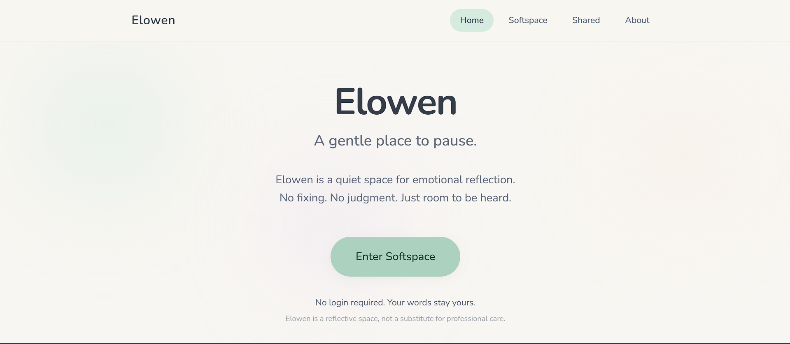
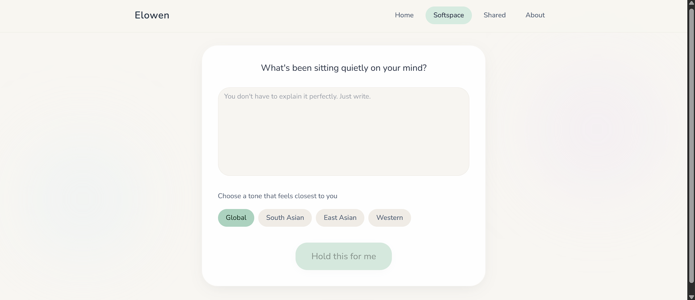
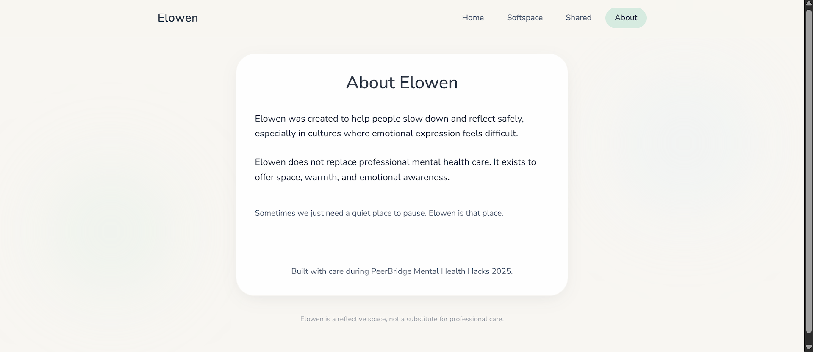

# 🌿 Elowen — A Gentle Place to Pause  
*A Soft, Emotionally Safe Reflection Space Powered by Empathetic AI*

**Elowen** is a calm, pastel-themed web application designed to help people pause, reflect, and feel emotionally acknowledged — without judgment, pressure, or solutions.  
At its heart is **Softspace**, a gentle AI-guided reflection experience that responds with empathy rather than advice, creating a warm, comforting space that feels like a quiet hug.

---

## 🎯 Project Objective

To create a **non-clinical, emotionally safe digital space** where users can express their feelings freely and receive gentle, validating responses — without being diagnosed, fixed, or optimized.

Elowen focuses on **presence over productivity** and **empathy over efficiency**.

---

## 🚀 Live Demo

🔗 **Website:** https://elowen-olive.vercel.app/  
🔗 **Demo Video:** https://youtu.be/XTCmwfcBUmY?si=hr9w4Mgz2ZWvfZxX  

---

## 🖥️ Tech Stack

- **Frontend:** HTML, CSS, JavaScript  
- **UI & App Builder:** Lovable.dev  
- **AI Layer:** Empathetic language model with constrained response logic  
- **Design Tools:** Figma / UI prototyping tools  
- **Architecture:** Frontend-first, privacy-focused, minimal-state design  

---

## 🌟 Features

### 🌸 Softspace — Gentle AI Reflection
- Free-form emotional expression  
- Empathetic, non-judgmental AI responses  
- No advice, diagnosis, or solutions  
- Designed to feel validating, not instructional  

### 🎨 Warm Pastel UI
- Soft color palette for emotional comfort  
- Minimal layouts to reduce cognitive load  
- Spacious typography and calming visual rhythm  

### 🧘 Slow, Intentional Experience
- No notifications or pressure loops  
- Encourages pausing and breathing  
- Designed for moments of emotional overwhelm  

### 🔒 Privacy-First by Design
- Anonymous reflection  
- No emotional scoring or labeling  
- No clinical data collection  

---

## 📸 Screenshots

---

### 🏠 Home — A Gentle Invitation to Pause


Elowen opens with softness and clarity.  
A minimal, pastel interface designed to reduce cognitive load and immediately create emotional safety — no urgency, no noise.

---

### 🌸 Softspace — Your Words, Held Gently


The core reflection experience.  
Users can express themselves freely and choose a tone that feels closest to them.  
The AI responds with validation only — no advice, no diagnosis, no fixing.

---

### 🌿 Shared — Small Pieces of Honesty


Anonymous reflections shared gently to foster quiet connection.  
Designed to help users feel less alone without exposure, comparison, or emotional metrics.

---

### 🤍 About — Why Elowen Exists


A transparent explanation of Elowen’s purpose and ethical boundaries.  
Clearly positioned as a reflective space — not a substitute for professional care.

- 🌿 Softspace Reflection Screen  
- 🎨 Pastel UI Layout  
- 🤍 Empathetic Response Flow  

---

## 📁 Folder Structure

```
.
├── public/
│ └── assets/
├── src/
│ ├── components/
│ ├── styles/
│ ├── pages/
│ └── main.js
├── index.html
├── package.json
└── README.md
```

---

## 🔧 Setup Instructions

### 1. Clone the Repository

```
git clone https://github.com/your-username/elowen.git
cd elowen
```

---


### 2. Install Dependencies

```
npm install
```

---

### 3. Start Development Server

```
npm run dev
```

---

### 4. Build for Production

```
npm run build
```

Deploy using `Lovable.dev`, `Vercel`, or `Netlify`.

---

## 🛠️ How We Built It

- **Softspace Logic:** Carefully constrained AI prompts to ensure empathy without advice 🤍  
- **UI Design:** Pastel palettes, soft spacing, and calming visual hierarchy 🎨  
- **Ethical AI Boundaries:** Clear limits to avoid therapy-like behavior 🧭  
- **Frontend-First Approach:** Fast, lightweight, and distraction-free 🌿  

---

## ⚙️ Challenges Faced

- Designing AI responses that feel warm without sounding scripted  
- Avoiding medical or therapeutic language entirely  
- Balancing emotional depth with interface simplicity  
- Creating impact with fewer features instead of more  

---

## 🏆 Accomplishments

- Built a non-clinical, emotionally safe AI experience  
- Designed a UI that communicates comfort without words  
- Defined strong ethical boundaries for reflective AI  
- Created a product that feels like a *space*, not a tool  

---

## 🌱 What We Learned

- Emotional UX is as critical as technical correctness  
- Less functionality can create more meaning  
- AI can support reflection without replacing human experience  
- Thoughtful constraints lead to safer, more humane products  

---

## 🌿 What’s Next for Elowen — A Gentle Place to Pause

- Optional reflection patterns over time (without pressure)  
- Expanded Softspace modes (prompts, guided pauses)  
- Accessibility improvements  
- Gentle personalization while preserving anonymity  

Elowen aims to remain a **soft, quiet corner of the internet** — a place to pause when the world feels loud.

---

## 📝 License

This project is open source under the **MIT License**.

---

## 💬 Final Note

> *“Not everything needs to be fixed. Some things just need to be held.”* 🤍  
Elowen exists for those moments.
